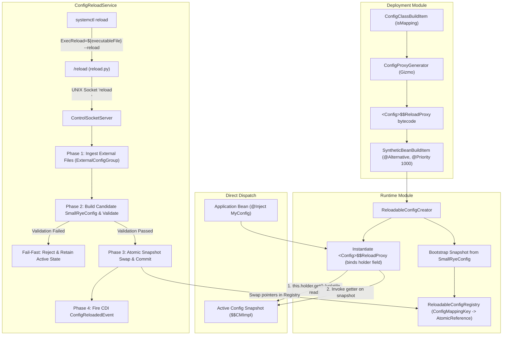

# Configuration Hot-Reload Architecture

This document describes the architectural design and runtime mechanics of the dynamic configuration hot-reload subsystem in `quarkus-debian-packaging`.

## 1. Overview

The extension enables live, zero-downtime configuration updates for Quarkus applications packaged as Debian services (`systemd`). Configuration changes applied to `/etc/<app>/application.properties` (and sibling profile files `/etc/<app>/application-<profile>.properties`) are reloaded on-demand via a UNIX domain socket command triggered by `systemctl reload <app>` (which executes `ExecReload=${executableFile} --reload`, delegating to `<installDir>/reload` and the embedded Python 3 `reload.py` script communicating over `/run/<app>/control.sock`).

Hot reload is disabled by default (`quarkus.debian.reload.enabled=false`), ensuring zero proxy compilation and zero runtime overhead unless explicitly enabled at build time via `quarkus.debian.reload.enabled=true`.

The architecture is built on four core design invariants:
1. **Direct Interface Dispatch**: Configuration getters dispatch via AOT-generated proxies backed by direct `AtomicReference` holder references without locks.
2. **Atomic Snapshot Swapping & Source Commit**: Configuration state transitions atomically via volatile reference updates after candidate snapshot validation succeeds across all active `@ConfigMapping` interfaces.
3. **Transparent CDI Alternative Beans**: Proxies are registered as Arc `@Alternative` synthetic beans with priority 1000, satisfying application `@Inject` injection points.
4. **Symmetric Proxy Equality**: Proxy `equals(Object)` strictly requires `instanceof <ProxyClassName>` and delegates to `Objects.equals(myTarget, otherTarget)`, ensuring mathematical symmetry and never matching raw mapping implementation classes.

---

## 2. External Configuration Hierarchy & Activation Latch

### 2.1 SmallRye Config Ordinals

External configuration files are integrated via SmallRye Config's `ConfigSourceFactory` SPI (`ExternalConfigSourceFactory`). Ordinals are strictly partitioned:

| Layer | Ordinal | Description |
|:---|:---|:---|
| Packaged Defaults | 250 | Bundled `application.properties` inside the JAR / executable |
| External Base File | **275** | `/etc/<app>/application.properties` |
| External Profile Files | **275 + N - i** (< 300) | `/etc/<app>/application-<profile>.properties`, ordered by profile priority |
| Environment Variables | 300 | Standard OS environment variables |
| System Properties | 400 | JVM system properties (`-Dkey=value`) |

Profile-specific files override the external base file, while OS environment variables (300) and system properties (400) continue to take precedence over external files.

### 2.2 Activation Latch (`QUARKUS_DEBIAN_EXTERNAL_CONFIG`)

To prevent non-packaged environments (`mvn package`, `quarkus:dev`, `@QuarkusTest`, unit tests) from inadvertently loading `/etc/<app>/application.properties` from the host build system, external configuration loading is gated by the environment latch:

```bash
export QUARKUS_DEBIAN_EXTERNAL_CONFIG=true
```

This variable is exported exclusively inside the production launcher script (`launcher.sh`) immediately after sourcing environment overrides from `/etc/default/<app>`. If the variable is unset or not equal to `true`, `ExternalConfigSourceFactory` returns an empty source collection.

---

## 3. Architectural Components



### 3.1 Build-Time AOT Proxy Generation (`deployment`)

During Quarkus extension augmentation:
- **`ConfigProxyGenerator`**: Inspects `@ConfigMapping` interfaces and compiles a lightweight proxy `<Interface>$$ReloadProxy implements <Interface>` using Gizmo bytecode generation.
- **Direct Holder Binding & Method Delegation**:
  Each generated proxy class declares a private final field:
  ```java
  private final AtomicReference<Object> holder;
  ```
  The proxy constructor binds this holder once upon creation via `ReloadableConfigRegistry.getHolder(Interface.class, prefix)`.
  Interface getter methods delegate directly to:
  ```java
  ((Interface) this.holder.get()).<method>();
  ```
- **Symmetric `equals` and `hashCode`**:
  ```java
  public boolean equals(Object other) {
      if (this == other) return true;
      if (!(other instanceof Interface$$ReloadProxy castOther)) return false;
      return Objects.equals(this.holder.get(), castOther.holder.get());
  }

  public int hashCode() {
      Object target = this.holder.get();
      return target == null ? 0 : target.hashCode();
  }
  ```
- **Arc Synthetic Alternative Bean**:
  `ConfigReloadProcessor` registers each proxy as a synthetic CDI bean targeting the config mapping interface:
  - Scope: `@Singleton`
  - Identifier: `<InterfaceName>_reloadable_proxy`
  - Alternative: `@Alternative` with `@Priority(1000)`
  - Creator: `ReloadableConfigCreator`
  Arc CDI container resolves this alternative over SmallRye's default non-alternative synthetic mapping bean, routing `@Inject MyConfig` to the reloadable proxy.

### 3.2 Thread-Safe Registry & Domain Model (`runtime`)

- **`ConfigMappingKey`**: Immutable domain record `(Class<?> mappingClass, String prefix)` identifying configuration mappings across the registry and reload service.
- **`ReloadableConfigRegistry`**: Maintains a thread-safe registry keyed by `ConfigMappingKey` mapped to an `AtomicReference<Object>`.
- **Atomic Pointer Swap**: Swapping configuration performs an atomic volatile pointer update (`AtomicReference.set(newSnapshot)`). Reading threads observe either the active valid snapshot or the new valid snapshot.

### 3.3 Transactional Configuration Reload (`ConfigReloadService`)

When a reload request arrives via the control socket (`ControlSocketServer`), `ConfigReloadService` executes a four-phase transaction coordinated by `ExternalConfigGroup`:

1. **Phase 1: Raw File Ingestion**:
   Reads `/etc/<app>/application.properties` and all active `/etc/<app>/application-<profile>.properties` files from disk into memory.
2. **Phase 2: Snapshot Validation & Candidate Construction**:
   Constructs candidate in-memory config sources with matching ordinals and builds a candidate `SmallRyeConfig` layered over existing bootstrap sources. SmallRye Config and Hibernate Validator validate all constraints across every registered mapping interface. If validation fails, the transaction aborts with descriptive error messages; existing runtime state remains unchanged.
3. **Phase 3: Atomic Pointer Swap & Source Commit**:
   Atomically commits the new property maps to active `ExternalConfigSource` instances and updates snapshots in `ReloadableConfigRegistry`.
4. **Phase 4: CDI Event Publication**:
   Dispatches a synchronous CDI `ConfigReloadedEvent` containing the updated keys for services requiring lifecycle notification.

---

## 4. Native Image & Performance Invariants

- **GraalVM Native Image Support**: Proxies are generated ahead-of-time during augmentation; proxy constructors are registered via `ReflectiveClassBuildItem`.
- **Hot-Path Execution**: Property access executes as a single field dereference (`getfield`) + volatile reference read (`holder.get()`) followed by monomorphic interface invocation.
- **Build Step Isolation**: When disabled (default), `registerReloadableProxies` and `setupConfigReload` exit immediately without producing synthetic beans or recording runtime initialization tasks, the reload helper script `<installDir>/reload` (by default `/usr/share/<app>/reload`) is not packaged into the Debian archive, `python3` is omitted from Debian package dependencies, and `ExecReload` is omitted from the systemd unit file. When enabled (`quarkus.debian.reload.enabled=true`), proxy registration runs prior to Arc injection validation, runtime recording executes in `setupConfigReload`, the reload helper is packaged, `python3` is included in `Depends`, and `ExecReload` is configured in systemd.
