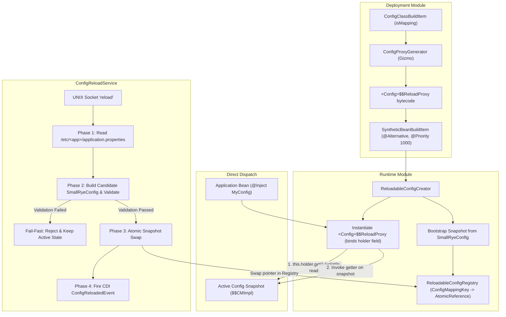

# Configuration Hot-Reload Architecture

This document describes the architectural design and runtime mechanics of the dynamic configuration hot-reload subsystem in `quarkus-debian-packaging`.

## 1. Overview

The extension enables live, zero-downtime configuration updates for Quarkus applications packaged as Debian services (`systemd`). Configuration changes applied to `/etc/<app>/application.properties` are reloaded on-demand via a UNIX domain socket command (`systemctl reload <app>` triggering `echo reload | nc -U /run/<app>/control.sock`).

Hot reload is disabled by default (`quarkus.debian.reload.enabled=false`), ensuring zero proxy compilation and zero runtime overhead unless explicitly enabled at build time via `quarkus.debian.reload.enabled=true`.

The architecture is built on three core design invariants:
1. **Direct Interface Dispatch**: Configuration getters dispatch via AOT-generated proxies backed by direct `AtomicReference` holder references.
2. **Atomic Snapshot Swapping**: Configuration state transitions atomically via volatile reference updates after candidate snapshot validation succeeds.
3. **Transparent CDI Alternative Beans**: Proxies are registered as Arc `@Alternative` synthetic beans with priority 1000, satisfying application `@Inject` injection points.

---

## 2. Architectural Components



### 2.1 Build-Time AOT Proxy Generation (`deployment`)

During Quarkus extension build time:
- **`ConfigProxyGenerator`**: Inspects `@ConfigMapping` interfaces and compiles a lightweight proxy `<Interface>$$ReloadProxy implements <Interface>` using Gizmo bytecode generation.
- **Direct Holder Binding & Method Delegation**:
  Each generated proxy class declares a private final field:
  ```java
  private final AtomicReference<Object> holder;
  ```
  The proxy constructor binds this holder once upon creation via `ReloadableConfigRegistry.getHolder(Interface.class, prefix)`.
  Interface getter methods delegate directly to:
  ```java
  ((Interface) this.holder.get()).<method>();
  ```
  Standard `Object` methods (`toString`, `hashCode`, `equals`) similarly forward through `this.holder.get()`.
- **Arc Synthetic Alternative Bean**:
  `ConfigReloadProcessor` registers each proxy as a synthetic CDI bean targeting the config mapping interface:
  - Scope: `@Singleton`
  - Identifier: `<InterfaceName>_reloadable_proxy`
  - Alternative: `@Alternative` with `@Priority(1000)`
  - Creator: `ReloadableConfigCreator`
  Arc CDI container resolves this alternative over SmallRye's default non-alternative synthetic mapping bean, routing `@Inject MyConfig` to the reloadable proxy.

### 2.2 Thread-Safe Registry & Domain Model (`runtime`)

- **`ConfigMappingKey`**: Immutable domain record `(Class<?> mappingClass, String prefix)` identifying configuration mappings across the registry and reload service.
- **`ReloadableConfigRegistry`**: Maintains a thread-safe registry keyed by `ConfigMappingKey` mapped to an `AtomicReference<Object>`.
- **Atomic Pointer Swap**: Swapping configuration performs an atomic volatile pointer update (`AtomicReference.set(newSnapshot)`). Reading threads observe either the active valid snapshot or the new valid snapshot.

### 2.3 Transactional Configuration Reload (`ConfigReloadService`)

When a reload request arrives via the control socket (`ControlSocketServer`), `ConfigReloadService` executes a four-phase transaction:

1. **Phase 1: Raw File Ingestion**:
   Reads `/etc/<app>/application.properties` from disk into memory.
2. **Phase 2: Snapshot Validation & Candidate Construction**:
   Constructs a candidate `SmallRyeConfig` instance backed by the new properties layered over default sources. SmallRye Config and Hibernate Validator validate all constraints. If validation fails, the reload operation terminates and returns descriptive errors, leaving existing runtime state intact.
3. **Phase 3: Atomic Pointer Swap & Source Commit**:
   Updates `ExternalConfigSource` and atomically replaces snapshots in `ReloadableConfigRegistry`.
4. **Phase 4: CDI Event Publication**:
   Dispatches a synchronous CDI `ConfigReloadedEvent` containing the updated keys for services requiring lifecycle notification.

---

## 3. Native Image & Performance Invariants

- **GraalVM Native Image Support**: Proxies are generated ahead-of-time during augmentation; proxy constructors are registered via `ReflectiveClassBuildItem`.
- **Hot-Path Execution**: Property access executes as a single field dereference (`getfield`) + volatile reference read (`holder.get()`) followed by monomorphic interface invocation.
- **Build Step Isolation**: When disabled (default), `registerReloadableProxies` and `setupConfigReload` exit immediately without producing synthetic beans or recording runtime initialization tasks, the reload helper script `<installDir>/reload` (by default `/usr/share/<app>/reload`) is not packaged into the Debian archive, and `ExecReload` is omitted from the systemd unit file. When enabled (`quarkus.debian.reload.enabled=true`), proxy registration runs in `registerReloadableProxies` consuming `ConfigClassBuildItem` prior to Arc injection validation, runtime recording executes in `setupConfigReload` consuming `ConfigMappingBuildItem`, the reload helper is packaged, and `ExecReload` is configured in systemd.
